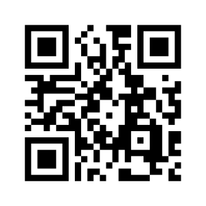

# QR Code Decoder


## What is a QR Code?

A [Quick Response (QR) code](https://en.wikipedia.org/wiki/QR_code) is two-dimensional [**barcode**](https://en.wikipedia.org/wiki/Barcode) first [designed in 1994](https://www.youtube.com/watch?v=LS1wrEv-fjk) for the automotive industry in Japan. A **barcode** is a machine-readable optical label that represents data.

A QR code consists of black squares arranged in a square grid on a white background, which can be read by any devices that have an embedded camera (QR code **scanner**), typically a smartphone. Data are then extracted from patterns that are present in both horizontal and vertical components of the image.

One common usage of a QR code is to open a website in a web browser on the device that captures the QR code:


The amount of data that can be stored in a QR code symbol depends on the **type** of the data (numeric, alphanumeric, binary, etc.), the **version** of the QR code, and the **error correction** level:

| Data type    | Max. characters |
| ------------ | --------------- |
| Numeric      | 7,089           |
| Alphanumeric | 4,296           |
| Binary       | 2,953           |

A QR code uses the [Reed–Solomon error correction](https://en.wikipedia.org/wiki/Reed%E2%80%93Solomon_error_correction) algorithm with four error correction levels. The higher the error correction level, the less storage capacity. The following table lists the approximate error correction capability at each of the four levels:

| Level        | Restorable characters |
| ------------ | --------------------- |
| **L**ow      | 7%                    |
| **M**edium   | 15%                   |
| **Q**uartile | 25%                   |
| **H**igh     | 30%                   |

Examples of QR code that represent the same data but with increasing error correction levels:

| Level `L`                                 | Level `M`                                 | Level `Q`                                 | Level `H`                                 |
| ----------------------------------------- | ----------------------------------------- | ----------------------------------------- | ----------------------------------------- |
|  |  |  |  |

Examples of damaged or embellished QR codes that will still scan correctly thanks to error correction:

| Damaged QR Code                                   | QR Code with Logo                       |
| ------------------------------------------------- | --------------------------------------- |
|  |  |

## Your Mission

There are few existing Python implementations of QR code reader ([`pyzbar`](https://github.com/NaturalHistoryMuseum/pyzbar), [`qrtools`](https://github.com/primetang/qrtools), others), but they all depend on other libraries ([OpenCV](https://opencv.org/), [Zbar](http://zbar.sourceforge.net/)), which your grandmother won't be able to install the same way on Windows, Mac, and Linux, in just one click, for sure. And you should consider most of the end users like your grandmother.

Your mission, should you choose to accept it, is to write a QR code finder and decoder in **pure Python**, without the help of any computer vision libraries. A **pure Python** library is a library that only contains Python code, and doesn't include, say, C extensions or code in other languages.

_Note: This **pure Python** implementation of a QR code finder and decoder is not intended to be used for real-time QR code decoding; it could take up to several seconds per image to detect and decode a QR code._

## Waypoint 1: Find QR Code Symbol Version

A QR code symbol is basically a matrix composed of cells with dark or light area, also known as **modules**. A **module** is comparable to a [binary digit (**bit**)](https://en.wikipedia.org/wiki/Bit). A **module** with a dark area corresponds to the **bit** `1`, while **module** with a light area corresponds to the **bit** `0`.

There are 40 sizes of QR code symbol referred to as **Version 1**, **Version 2**, etc. **Version 1** measures 21x21 **modules**, **Version 2** measures 25x25 **modules** and so on increasing in steps of 4 **modules** per side up.

As specified in the _QR Code Standardization ISO 18004_ document:

> _The finder pattern shall consist of three identical Position Detection Patterns located at the upper left, upper right and lower left corners of the symbol respectively. Each Position Detection Pattern may be viewed as three superimposed concentric squares and is constructed of dark 7x7 modules, light 5x5 modules and dark 3x3 modules. The ratio of module widths in each Position Detection Pattern is `1:1:3:1:1`._


Write a function `find_qr_code_version` that takes an argument `image` (an object `PIL.Image` of a QR code symbol) and an argument `position_detection_patterns` (a list of objects representing the position detection patterns of the QR code).

The function `find_qr_code_version` returns a tuple of two integers `(version, width)` corresponding respectively to the version of this QR code symbol and the number of modules (on one row of the QR code symbol).

For example:

```python
>>> qr_codes = find_qr_codes('DSC07310.jpg')
>>> qr_code = qr_codes[0]
>>> print(find_qr_code_version(qr_code.image, qr_code.position_detection_patterns))
(2, 25)
```

## Waypoint 2: Convert QR Code Symbol to Array of Bits

Write a function `convert_qr_code_to_bit_array` that takes an argument `image` (an object `PIL.Image` of QR code symbol) and an argument `position_detection_patterns` (a list of objects representing the position detection patterns of the QR code).

The function `convert_qr_code_to_bit_array` returns an array of integers `0` and `1` representing the modules of the QR code symbol.

For example:

```python
>>> qr_codes = find_qr_codes('DSC07310.jpg')
>>> qr_code = qr_codes[0]
>>> print(convert_qr_code_to_bit_array(qr_code.image, qr_code.position_detection_patterns))
[
    [1, 1, 1, 1, 1, 1, 1, 0, 1, 0, 0, 0, 0, 0, 0, 1, 1, 0, 1, 1, 1, 1, 1, 1, 1],
    [1, 0, 0, 0, 0, 0, 1, 0, 1, 1, 0, 1, 1, 1, 1, 1, 0, 0, 1, 0, 0, 0, 0, 0, 1],
    [1, 0, 1, 1, 1, 0, 1, 0, 0, 1, 1, 1, 0, 0, 1, 0, 1, 0, 1, 0, 1, 1, 1, 0, 1],
    [1, 0, 1, 1, 1, 0, 1, 0, 1, 1, 0, 1, 0, 0, 1, 0, 1, 0, 1, 0, 1, 1, 1, 0, 1],
    [1, 0, 1, 1, 1, 0, 1, 0, 0, 0, 1, 0, 1, 0, 1, 1, 1, 0, 1, 0, 1, 1, 1, 0, 1],
    [1, 0, 0, 0, 0, 0, 1, 0, 1, 0, 1, 0, 0, 1, 0, 1, 0, 0, 1, 0, 0, 0, 0, 0, 1],
    [1, 1, 1, 1, 1, 1, 1, 0, 1, 0, 1, 0, 1, 0, 1, 0, 1, 0, 1, 1, 1, 1, 1, 1, 1],
    [0, 0, 0, 0, 0, 0, 0, 0, 0, 0, 0, 0, 1, 1, 0, 0, 1, 0, 0, 0, 0, 0, 0, 0, 0],
    [1, 1, 1, 1, 1, 0, 1, 1, 1, 1, 1, 0, 1, 1, 1, 1, 0, 1, 0, 1, 0, 1, 0, 1, 0],
    [1, 1, 0, 1, 0, 1, 0, 1, 0, 1, 0, 0, 0, 0, 0, 0, 1, 1, 0, 1, 1, 0, 0, 0, 1],
    [0, 0, 0, 0, 1, 1, 1, 1, 0, 1, 0, 1, 1, 1, 1, 0, 0, 1, 1, 0, 1, 0, 1, 0, 0],
    [1, 0, 0, 1, 1, 1, 0, 1, 0, 1, 1, 1, 0, 0, 1, 0, 0, 0, 0, 0, 0, 0, 0, 0, 0],
    [1, 0, 1, 1, 1, 1, 1, 1, 0, 1, 0, 1, 0, 1, 1, 1, 1, 0, 0, 1, 1, 1, 0, 1, 1],
    [1, 1, 1, 0, 0, 0, 0, 1, 1, 0, 1, 0, 1, 0, 0, 0, 0, 1, 1, 1, 1, 0, 0, 0, 1],
    [1, 0, 1, 1, 1, 1, 1, 0, 1, 1, 1, 0, 0, 1, 1, 0, 0, 1, 1, 0, 1, 0, 1, 1, 1],
    [1, 0, 0, 1, 1, 0, 0, 0, 0, 0, 1, 0, 1, 1, 0, 0, 1, 0, 0, 0, 0, 0, 0, 1, 1],
    [1, 0, 1, 0, 1, 0, 1, 0, 1, 1, 0, 0, 1, 1, 1, 1, 1, 1, 1, 1, 1, 1, 0, 0, 1],
    [1, 1, 1, 1, 1, 1, 1, 0, 1, 1, 0, 1, 1, 0, 0, 1, 1, 0, 1, 0, 1, 0, 1, 1, 1],
    [1, 0, 0, 0, 0, 0, 1, 0, 0, 1, 1, 1, 0, 0, 0, 0, 1, 0, 0, 0, 1, 1, 0, 0, 0],
    [1, 0, 1, 1, 1, 0, 1, 0, 1, 0, 1, 1, 0, 0, 0, 1, 1, 1, 1, 1, 1, 1, 0, 0, 0],
    [1, 0, 1, 1, 1, 0, 1, 0, 1, 0, 0, 0, 1, 1, 0, 1, 1, 1, 0, 0, 1, 0, 0, 1, 1],
    [1, 0, 1, 1, 1, 0, 1, 0, 1, 0, 0, 0, 0, 1, 1, 0, 0, 0, 0, 0, 1, 0, 1, 0, 1],
    [1, 0, 0, 0, 0, 0, 1, 0, 1, 1, 0, 0, 1, 1, 0, 1, 0, 1, 1, 1, 1, 1, 0, 1, 0],
    [1, 1, 1, 1, 1, 1, 1, 0, 1, 1, 1, 0, 1, 0, 1, 0, 0, 1, 0, 0, 0, 0, 1, 1, 1]
]
```

## Waypoint 3: Decode QR Code Symbol

Write a function `decode_qr_code_from_array` that takes an argument `qr_code_array` (an array of integers `0` and `1` representing the modules of the QR code symbol) and that returns the value of this QR code symbol.

For example:

```python
>>> qr_codes = find_qr_codes('DSC07310.jpg')
>>> qr_code = qr_codes[0]
>>> qr_code_array = convert_qr_code_to_bit_array(qr_code.image, qr_code.position_detection_patterns)
>>> decode_qr_code_from_array(qr_code_array)
'https://intek.edu.vn'
```

Enjoy!


---


A French Street Artist Made \$1,000 After Adding a Bitcoin QR Code to His Murals

https://www.nayuki.io/page/creating-a-qr-code-step-by-step
